# DESPLIEGUE — Evidencias y respuestas

Este documento recopila todas las evidencias y respuestas de la practica.

---

# Práctica P4.1 — Despliegue de una web estática (Nginx + SFTP + Docker)

## Objetivo
Montar un entorno con Docker Compose donde:

- Un contenedor **Nginx** sirva contenido estático.
- Un contenedor **SFTP** permita subir/actualizar esos archivos.
- Ambos compartan **el mismo volumen/carpeta**, de forma que lo que subo por SFTP se vea al momento en el navegador.
- Añadir **HTTPS** con certificado autofirmado y **redirigir HTTP → HTTPS**.

---

## Estructura del repo
- `www/` → carpeta que se compartirá entre Nginx y SFTP (aquí irá la web).
- `evidencias/` → capturas de pantalla para el checklist.
- `docker-compose.yml` → lo crearé según los requisitos.
- `default.conf` → configuración de Nginx para HTTPS + redirección.
- certificados `nginx-selfsigned.crt` y `nginx-selfsigned.key`.

---

### 1) Docker Compose con 2 servicios
**Requisitos obligatorios del enunciado**:

- Servicio Nginx con **imagen oficial**.
- Mapear **puerto 80 del contenedor → 8080 del host**.
- Servicio SFTP (por ejemplo `atmoz/sftp`).
- Mapear **puerto 22 del contenedor → 2222 del host**.
- Configurar usuario/contraseña en SFTP.
- **Volumen compartido**: ambos servicios deben apuntar a la misma carpeta/volumen.

Comprobación esperada:
- Entrando a `http://localhost:8080` se ve la web.
- Subiendo archivos por SFTP al puerto 2222, se actualizan sin reiniciar.

### 2) Subida de las dos webs por SFTP
Debo desplegar:

1) Web principal: `https://github.com/cloudacademy/static-website-example`
   - Debe verse en la raíz: `http://localhost:8080`

2) Web secundaria: `https://github.com/ArchiDep/static-clock-website`
   - Debe estar en una carpeta `reloj/` y verse en: `http://localhost:8080/reloj`

#### Cómo lo hago con FileZilla (lo que pide el checklist)

Importante (para que conecte):

- En FileZilla, la **Conexión rápida** suele intentar FTP/HTTP y no SFTP.
- Para SFTP, lo más fiable es ir a **Archivo → Gestor de sitios…** y crear un sitio nuevo.

Datos de conexión (con la configuración actual):

- Protocolo: **SFTP - SSH File Transfer Protocol**
- Host: `localhost` (si falla, probar `127.0.0.1`)
- Puerto: `2222`
- Usuario: `daw`
- Contraseña: `daw`

Si sale un error tipo “protocolo incorrecto”, revisar que NO se este usando:

- `http://localhost`
- FTP normal

Porque el servidor del contenedor escucha **SSH/SFTP**, no HTTP.

Ruta remota importante:

- Al conectar, la carpeta remota `upload/` es la que está compartida con Nginx.
- Todo lo que suba a `upload/` se verá en el navegador.

Qué carpetas locales subo (ya descargadas en este repo):

- Web principal (Cloud Academy): subir el contenido de `downloads/static-website-example/` directamente dentro de `upload/`.
   - Resultado esperado: al abrir `http://localhost:8080` (o `https://localhost:8443`) se ve la web.
- Web secundaria (Reloj): crear dentro de `upload/` una carpeta `reloj/` y subir dentro el contenido de `downloads/static-clock-website/`.
   - Resultado esperado: `http://localhost:8080/reloj` (o `https://localhost:8443/reloj`).

### 3) HTTPS + redirección
Tengo que:

- Generar certificado autofirmado (`.crt` y `.key`) en el host.
- Montarlo dentro del contenedor Nginx.
- Montar un `default.conf` propio en Nginx.
- Configurar dos `server`:
  - Uno en 80 que redirija a 443.
  - Otro en 443 que sirva el contenido.

---

## Checklist de evaluación + dónde pongo cada captura


### Fase 1: Instalación y Configuración

1. ✅ Servicio Nginx activo
   - Captura requerida: salida de `docker compose ps` mostrando el servicio activo (o equivalente).
   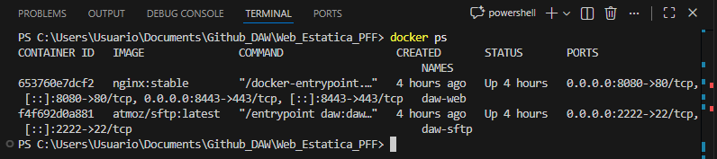

2. Configuración cargada
   - Captura requerida: listado de `/etc/nginx/conf.d/` (o ruta equivalente) donde se vea tu `.conf`.
   

3. Resolución de nombres (hosts)
   - Captura requerida: navegador mostrando `http://nombre_web` (no IP) y página cargada.
   

4. ✅ Contenido Web (Cloud Academy)
   - Captura requerida: se ve la web importada, no la página por defecto de Nginx.
   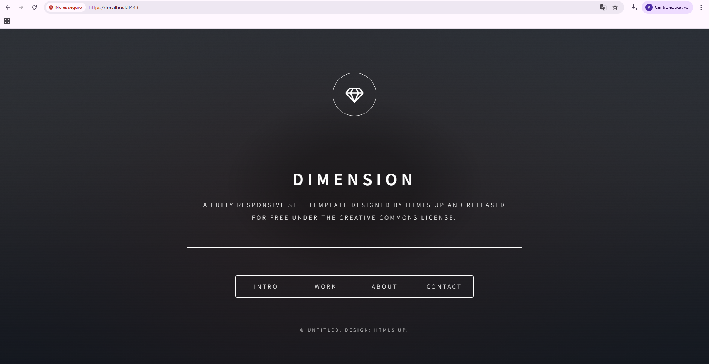

### Fase 2: Transferencia SFTP (Filezilla)

5. ✅ Conexión SFTP exitosa
   - Captura requerida: Filezilla con “Connected to …” y listado remoto.
   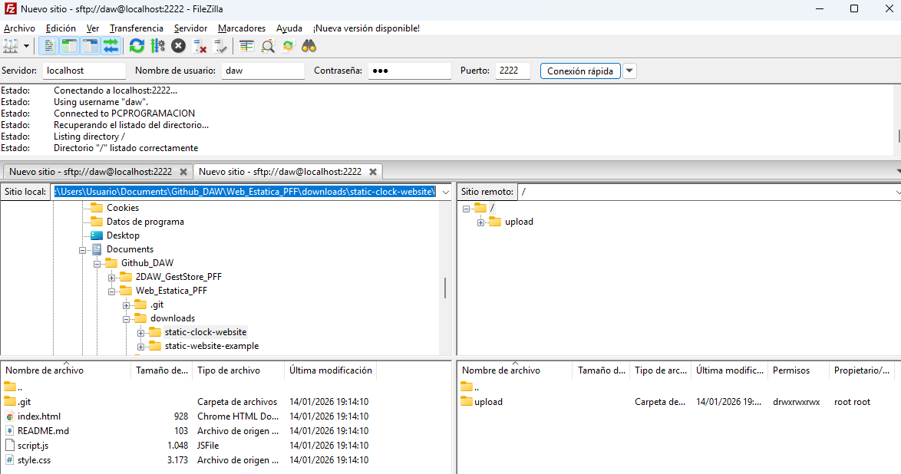

6. ✅ Permisos de escritura (sin Permission denied)
   - Captura requerida: transferencia completada o archivos visibles en remoto.
   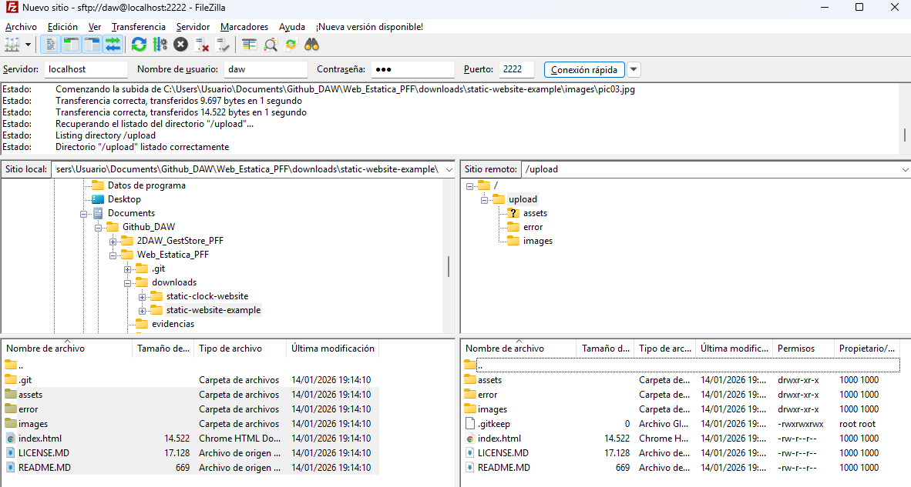

### Fase 3: Infraestructura Docker

7. ✅ Contenedores activos (Nginx + SFTP)
   - Captura requerida: `docker compose ps` con ambos Up y puertos `8080->80` y `2222->22`.
   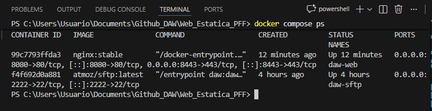

8. ✅ Persistencia (lo que subo por SFTP se ve en web)
   - Captura requerida: evidencia cruzada (Filezilla + navegador) mostrando los mismos archivos.
   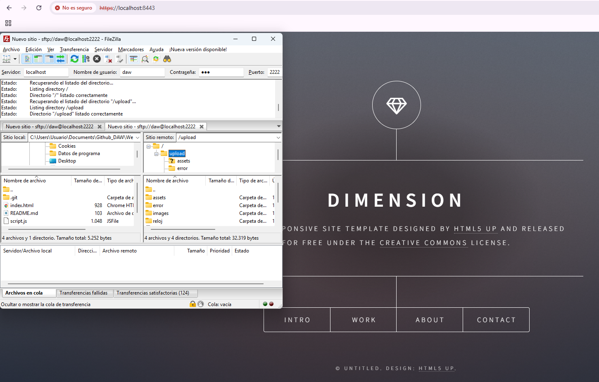

9. ✅ Multi-sitio (reloj en subcarpeta)
   - Captura requerida: navegador en `http://localhost:8080/reloj` con el reloj funcionando.
   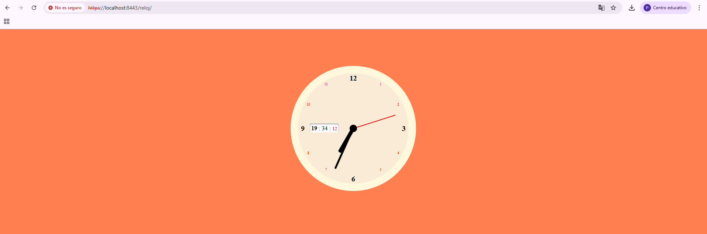

### Fase 4: Seguridad HTTPS

10. ✅ Cifrado SSL
   - Captura requerida: navegador en `https://…` mostrando candado o aviso de certificado y el puerto usado (ej. 8443).
   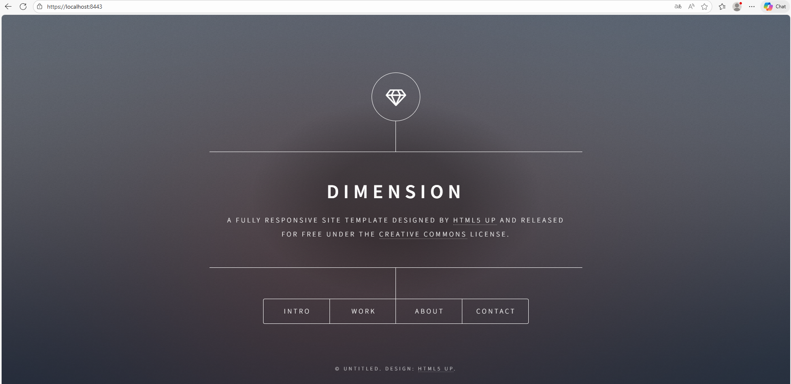

11. ✅ Redirección forzada HTTP → HTTPS
   - Captura requerida: pestaña Network (F12) mostrando `301 Moved Permanently` al entrar por HTTP.
   

---

## Comentarios de errores y aprendizaje durante la practica
- Nginx suele servir desde `/usr/share/nginx/html` (depende de imagen/config).
- En `atmoz/sftp`, normalmente se sube a una carpeta tipo `/home/<usuario>/upload`.
- Si hay “Permission denied”, tengo que revisar:
  - la ruta exacta del volumen compartido en ambos contenedores
  - permisos del directorio en el host
  - si el contenedor SFTP está escribiendo en el mismo sitio que Nginx lee

  Trabajo originalmente realizado en este repositorio: https://github.com/IES-Rafael-Alberti/Web_Estatica_PFF.git

## Parte 2 — Evaluacion RA2 (a–j)

### a) Parametros de administracion

Para ver los parámetros importantes del servidor, ejecuto un grep dentro del contenedor para buscar las directivas principales en el archivo nginx.conf:

```bash
docker compose exec web sh -c "grep -nE 'worker_processes|worker_connections|access_log|error_log|gzip|include|keepalive_timeout' /etc/nginx/nginx.conf"
```

**Explicación de cada directiva:**

- **worker_processes**: Controla cuántos procesos de Nginx se lanzan. Lo típico es ponerlo en `auto` para que use todos los cores disponibles. Si lo pones muy bajo (ej: 1 en un servidor con 8 cores), estarías desaprovechando recursos.

- **worker_connections**: Define cuántas conexiones simultáneas puede manejar cada worker. Si lo pones muy bajo (ej: 10), cuando lleguen más usuarios van a tener que esperar o directamente error.

- **access_log**: Indica dónde se guardan los logs de acceso. Si pones una ruta que no existe o sin permisos, Nginx no arranca.

- **error_log**: Lo mismo pero para errores. Super importante para debuggear.

- **keepalive_timeout**: Tiempo que mantiene una conexión abierta esperando más peticiones del mismo cliente. Un valor muy alto (ej: 300) consumiría recursos innecesarios.

- **include**: Carga archivos de configuración externos. Si pones un path que no existe, Nginx falla al arrancar.

- **gzip**: Compresión de respuestas. Si está comentado o en off, las respuestas van sin comprimir y pesan más.

Para aplicar un cambio seguro, modifico el keepalive_timeout en mi default.conf. Luego valido la config:

```bash
docker compose exec web nginx -t
```


Y recargo sin reiniciar:

```bash
docker compose exec web nginx -s reload
```

- Evidencias:
  - 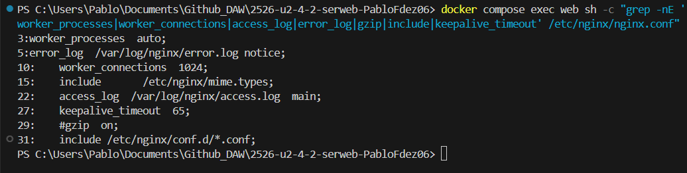
  - 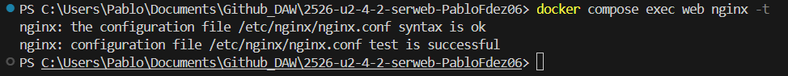
  - 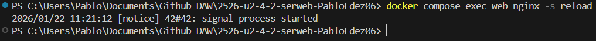

---

### b) Ampliacion de funcionalidad + modulo investigado

**Opcion elegida: B2 (Cabeceras de seguridad)**

He añadido cabeceras de seguridad en el bloque server de HTTPS de mi default.conf. Las cabeceras que puse son:

- **X-Content-Type-Options: nosniff** → Evita que el navegador intente adivinar el tipo de contenido. Así no pueden colar un archivo malicioso haciéndose pasar por otro tipo.

- **X-Frame-Options: DENY** → Impide que mi web se meta dentro de un iframe en otra página. Esto previene ataques de clickjacking.

- **Content-Security-Policy** → Controla desde dónde se pueden cargar recursos (scripts, estilos, etc). Puse una básica para que solo cargue cosas de mi propio dominio.


Valido que la config está bien:

```bash
docker compose exec web nginx -t
```


Y compruebo con curl que las cabeceras aparecen:

```bash
curl -I -k https://localhost:8443/
```


- Evidencias:
  - 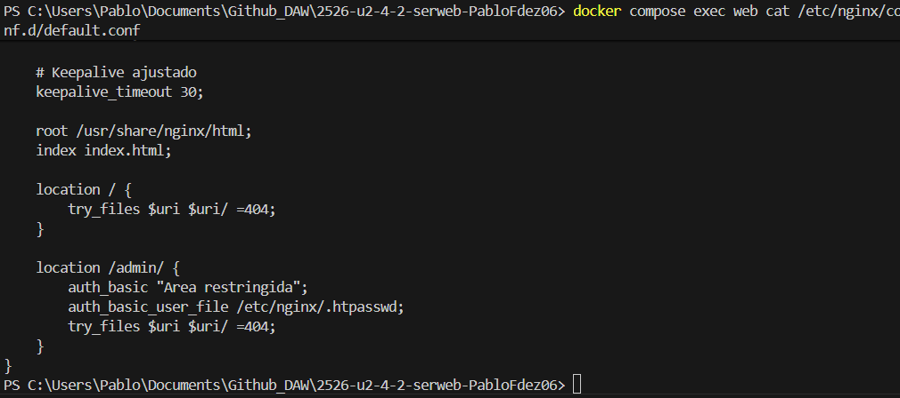
  - 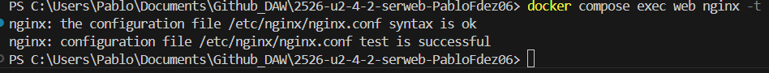
  - 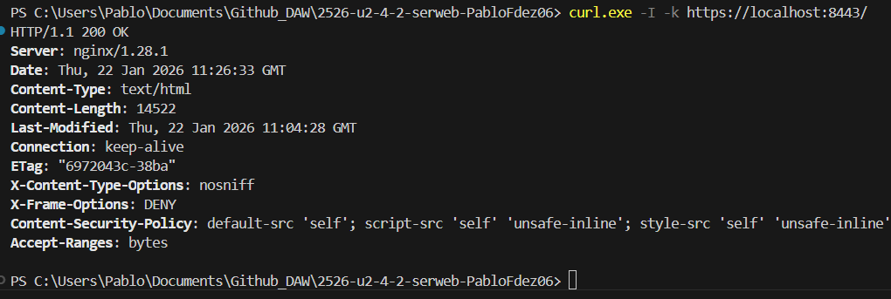

#### Modulo investigado: ngx_http_geoip2_module

- **Para qué sirve**: Este módulo permite detectar la ubicación geográfica de los visitantes usando su IP. Así puedes bloquear países, redirigir según región, mostrar contenido diferente por país, etc.

- **Cómo se instala/carga**: No viene incluido en la imagen oficial de Nginx. Hay que compilarlo desde código fuente o usar una imagen que ya lo tenga (como nginx-plus o imágenes custom). Se carga con la directiva `load_module modules/ngx_http_geoip2_module.so;` al principio del nginx.conf.

- **Fuente(s)**: 
  - https://github.com/leev/ngx_http_geoip2_module
  - https://nginx.org/en/docs/http/ngx_http_geoip_module.html

---

### c) Sitios virtuales / multi-sitio

Ya tengo configurado el multi-sitio por path. La web principal está en `/` y la del reloj en `/reloj`.

**Diferencia entre multi-sitio por path y por nombre:**

El multi-sitio por path es cuando tienes todo bajo el mismo dominio pero en rutas diferentes (ej: misite.com/ y misite.com/reloj). Usas `location` para separar cada "sitio".

El multi-sitio por nombre (server_name) es cuando tienes dominios diferentes (ej: web1.com y web2.com) apuntando al mismo servidor. Nginx usa `server_name` para saber qué bloque server usar según el dominio que pide el cliente.

**Otros tipos de multi-sitio:**

1. **Por puerto**: Diferentes sitios en diferentes puertos (ej: :80 para uno, :8081 para otro). Usas `listen` con diferentes puertos.

2. **Por IP**: Si el servidor tiene varias IPs, puedes asignar cada sitio a una IP diferente con `listen IP:puerto`.

3. **Por subdominio**: Es un caso de server_name pero con subdominios (blog.misite.com, tienda.misite.com).

Mi configuración activa está en `/etc/nginx/conf.d/default.conf`. Las directivas clave son:
- `root /usr/share/nginx/html` → de donde saca los archivos
- `location /` → captura peticiones a la raíz
- `try_files` → busca el archivo, si no existe prueba como directorio, si no 404

Para /reloj funciona porque la carpeta reloj está dentro de www/ y Nginx la sirve automáticamente.

```bash
docker compose exec web sh -c "cat /etc/nginx/conf.d/default.conf"
```

- Evidencias:
  - 
  - 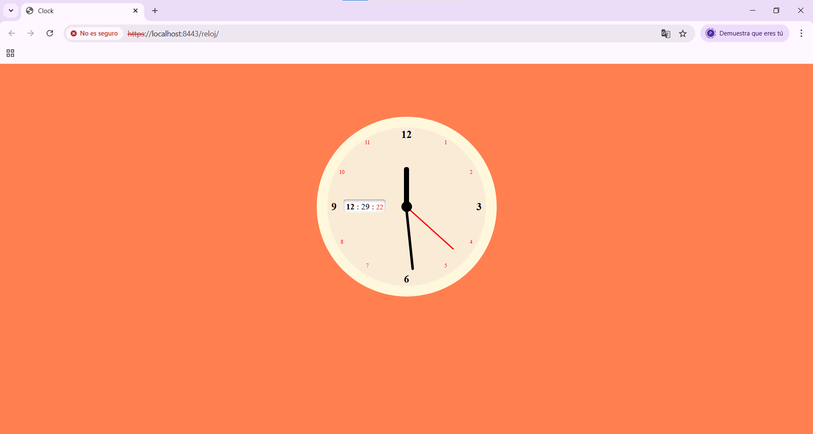
  - 

---

### d) Autenticacion y control de acceso

Para proteger la ruta /admin he hecho lo siguiente:

1. Primero creé la carpeta admin dentro de www con un index.html básico:

```html
<!DOCTYPE html>
<html>
<head><title>Admin</title></head>
<body><h1>Panel de Administracion</h1><p>Solo para usuarios autorizados.</p></body>
</html>
```

2. Generé el archivo .htpasswd con un usuario y contraseña:

```bash
htpasswd -c .htpasswd admin
```

(Le puse la contraseña Admin1234!)

3. Añadí en mi default.conf un location para /admin con auth_basic:

```nginx
location /admin/ {
    auth_basic "Area restringida";
    auth_basic_user_file /etc/nginx/.htpasswd;
    try_files $uri $uri/ =404;
}
```

4. Probé sin credenciales y me devuelve 401:

```bash
curl -I -k https://localhost:8443/admin/
```

5. Probé con credenciales y me devuelve 200:

```bash
curl -I -k -u admin:Admin1234! https://localhost:8443/admin/
```

- Evidencias:
  - 
  - 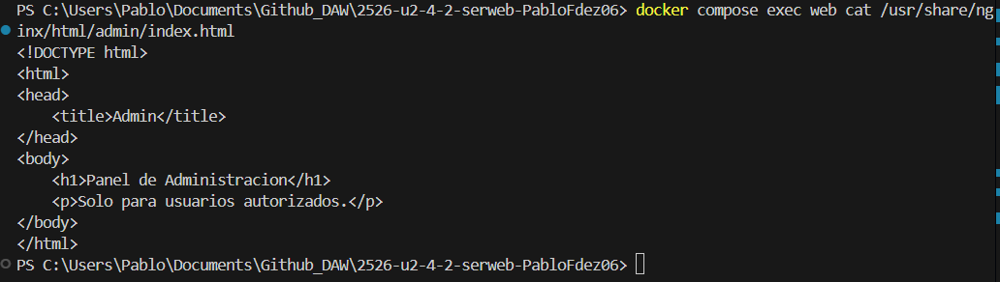
  - 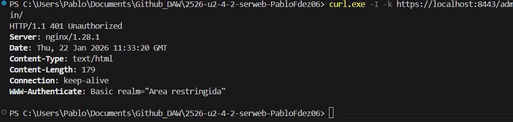
  - 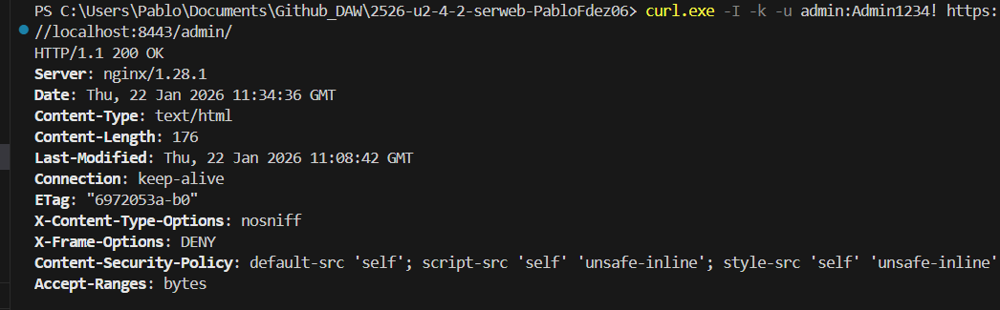

---

### e) Certificados digitales

**¿Qué es .crt y .key?**

- El archivo **.crt** es el certificado público. Contiene la clave pública y la info del servidor. Es lo que se envía a los clientes para que puedan cifrar la comunicación.

- El archivo **.key** es la clave privada. Nunca se comparte, solo la tiene el servidor. Se usa para descifrar lo que el cliente envía cifrado con la clave pública.

**¿Por qué se usa -nodes?**

El flag `-nodes` (no DES) hace que la clave privada se genere sin contraseña. En producción esto sería un riesgo, pero en laboratorio lo usamos porque si no, cada vez que Nginx arranque pediría la contraseña manualmente y eso es un rollo para pruebas.

Listo los certificados en el host:

```bash
ls -l certs/
```

En el docker-compose.yml los monto así:

```yaml
volumes:
  - ./certs/webpff.crt:/etc/ssl/certs/webpff.crt:ro
  - ./certs/webpff.key:/etc/ssl/private/webpff.key:ro
```

Y en default.conf los uso con:

```nginx
ssl_certificate /etc/ssl/certs/webpff.crt;
ssl_certificate_key /etc/ssl/private/webpff.key;
```

- Evidencias:
  - 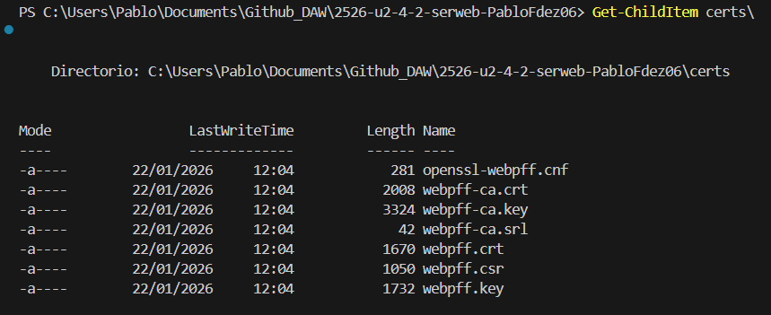
  - 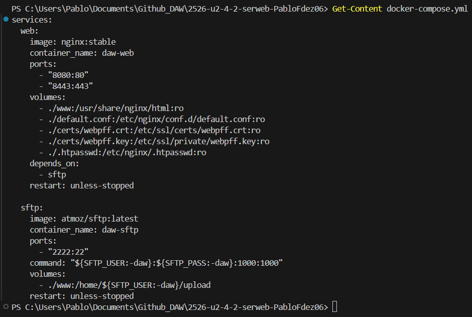
  - 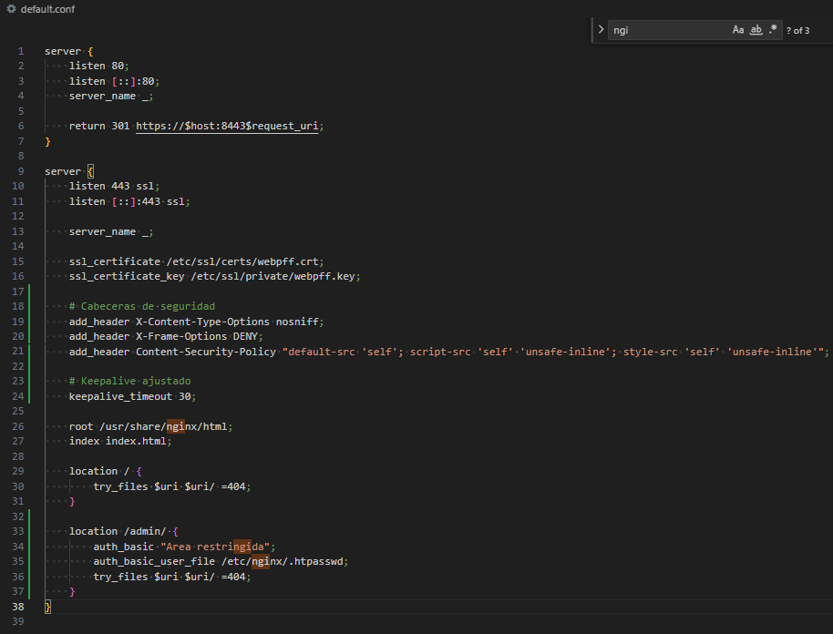

---

### f) Comunicaciones seguras

HTTPS está funcionando correctamente. Cuando entro por https://localhost:8443 me sale el aviso del certificado autofirmado (normal, no está firmado por una CA reconocida), pero la conexión está cifrada.

La redirección HTTP→HTTPS también funciona. Tengo dos bloques server:

- El primero escucha en puerto 80 y solo hace un `return 301` hacia HTTPS.
- El segundo escucha en 443 con SSL y es el que realmente sirve el contenido.

¿Por qué dos bloques? Porque quiero que si alguien entra por HTTP, automáticamente lo mande a HTTPS. El 301 indica redirección permanente, así el navegador la recuerda.

Para comprobarlo, abro DevTools (F12) → Network y entro por http://localhost:8080. Veo el 301 Moved Permanently.

- Evidencias:
  - 
  - 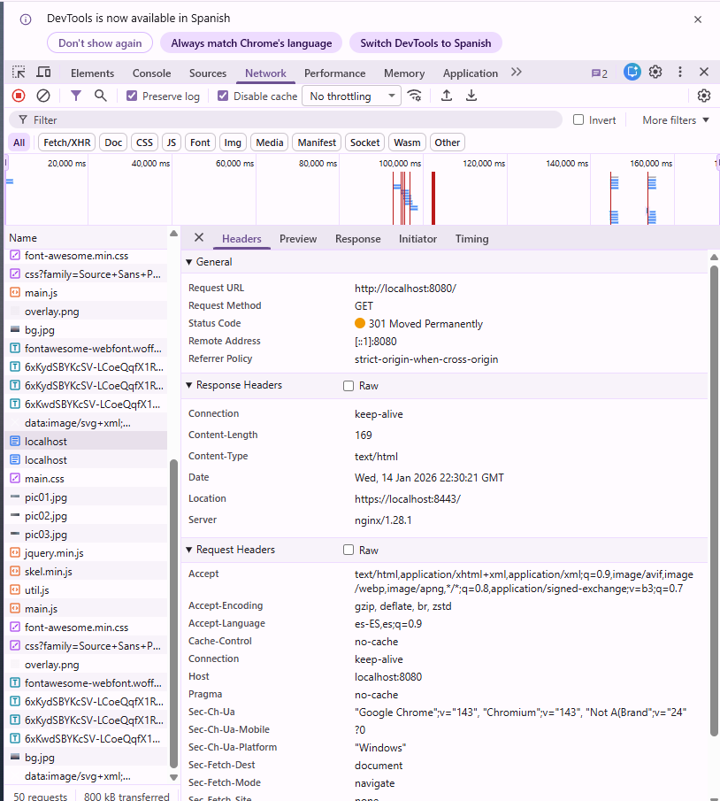
  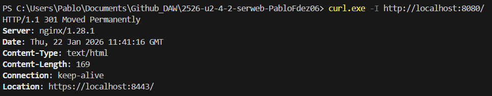

---

### g) Documentacion

**Arquitectura del proyecto:**

- **Servicio web (Nginx)**: Imagen `nginx:stable`, puertos 8080:80 y 8443:443. Sirve contenido estático desde /usr/share/nginx/html.

- **Servicio sftp**: Imagen `atmoz/sftp:latest`, puerto 2222:22. Permite subir archivos por SFTP que se ven automáticamente en la web.

- **Volumen compartido**: La carpeta `www/` del host está montada en ambos contenedores. Lo que subo por SFTP aparece en Nginx al instante.

**Configuración Nginx:**

- El archivo `default.conf` está montado en `/etc/nginx/conf.d/default.conf`
- Tiene dos bloques server: uno para redirigir HTTP a HTTPS, otro para servir por HTTPS
- Root en `/usr/share/nginx/html`
- /reloj funciona porque está como subcarpeta dentro de www/

**Seguridad implementada:**

- Certificados autofirmados para HTTPS
- Redirección forzada HTTP→HTTPS (301)
- Cabeceras de seguridad (X-Content-Type-Options, X-Frame-Options, CSP)
- Autenticación básica para /admin con .htpasswd

**Logs:**

- Access log en /var/log/nginx/access.log
- Error log en /var/log/nginx/error.log
- Se pueden ver en tiempo real con `docker compose logs -f web`

Todas las evidencias están en la carpeta `evidencias/` y enlazadas en cada sección de este documento.

---

### h) Ajustes para implantacion de apps

**Desplegar una segunda app en /reloj:**

Para que funcione una app en una subruta como /reloj, hay que tener cuidado con las rutas. Si la app usa rutas absolutas (empiezan con /) van a buscar en la raíz del servidor, no dentro de /reloj. Lo ideal es que use rutas relativas o que se configure una base URL.

En mi caso, el reloj usa rutas relativas así que funcionó sin problemas. Solo tuve que meter los archivos en www/reloj/ y listo.

**Problema típico de permisos por SFTP:**

El problema más común es "Permission denied" al subir archivos. Esto pasa porque el usuario del contenedor SFTP (uid 1000) puede no tener permisos de escritura en la carpeta montada.

La solución fue asegurarme de que la carpeta www/ en el host tiene permisos adecuados, y en el docker-compose el usuario sftp está configurado con uid:gid 1000:1000 que coincide con mi usuario del host.

- Evidencias:
  - 
  - 

---

### i) Virtualizacion en despliegue

**Diferencia entre instalación nativa y contenedores:**

Con una **instalación nativa** en el SO, Nginx queda instalado directamente en la máquina. Si se actualiza el SO o se instalan otras cosas, puede haber conflictos. Además, la configuración queda mezclada con el sistema.

Con **contenedores**, Nginx corre aislado. La configuración va por volúmenes, así que puedo destruir el contenedor y levantarlo de nuevo sin perder nada. Es más fácil de replicar (mismo docker-compose en otro servidor = misma configuración). También puedo tener varias versiones de Nginx corriendo a la vez sin problemas.

Lo malo de los contenedores es que añaden una capa extra de complejidad y hay que saber un poco de Docker.

Muestro los contenedores activos:

```bash
docker compose ps
```

- Evidencias:
  - 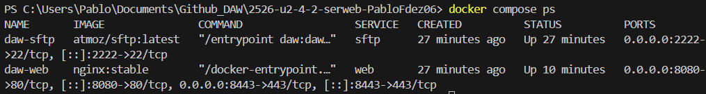

---

### j) Logs: monitorizacion y analisis

Para esta parte he navegado varias veces en la pagina a cualquier parte:


Luego monitorizo los logs en tiempo real:

```bash
docker compose logs -f web
```

Para extraer las métricas uso awk dentro del contenedor:

```bash

# URLS 
docker compose exec web sh -c "awk '{print \$7}' /var/log/nginx/access.log | sort | uniq -c | sort -nr | head"

# Códigos de respuesta
docker compose exec web sh -c "awk '{print \$9}' /var/log/nginx/access.log | sort | uniq -c | sort -nr | head"

# URLs que dieron 404
docker compose exec web sh -c "awk '\$9==404 {print \$7}' /var/log/nginx/access.log | sort | uniq -c | sort -nr | head"
```

- Evidencias:
  - 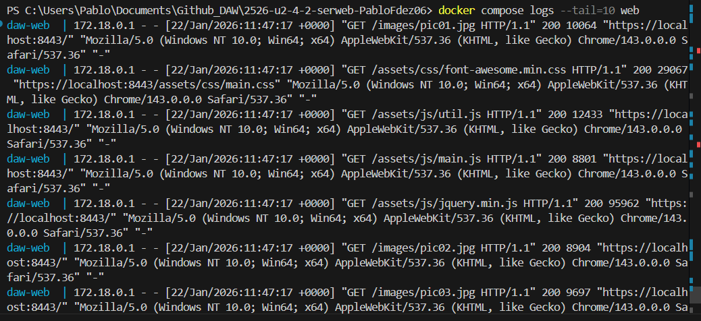
  - 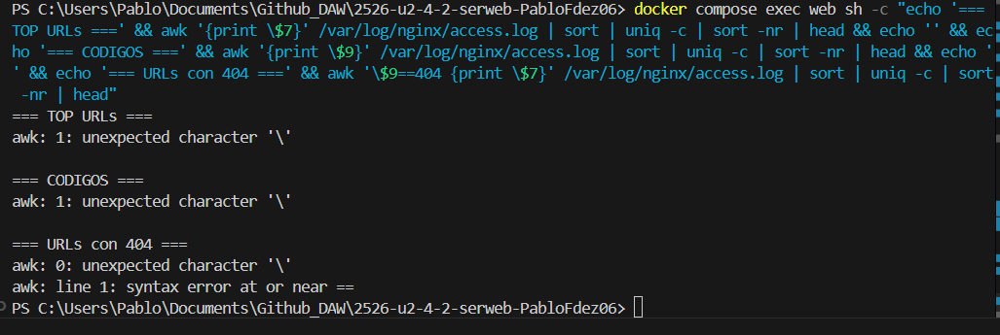 cuando ejecuto los comandos necesarios para esta captura solo se ejecuta 1, los demas se quedan colgado por mas que trato diferentes variantes, no soy capaz de obtener respuesta. 

   
---

## Checklist final

### Parte 1
- [x] 1) Servicio Nginx activo
- [x] 2) Configuracion cargada
- [x] 3) Resolucion de nombres
- [x] 4) Contenido Web (Cloud Academy)
- [x] 5) Conexion SFTP exitosa
- [x] 6) Permisos de escritura
- [x] 7) Contenedores activos
- [x] 8) Persistencia (Volumen compartido)
- [x] 9) Despliegue multi-sitio (/reloj)
- [x] 10) Cifrado SSL
- [x] 11) Redireccion forzada (301)

### Parte 2 (RA2)
- [x] a) Parametros de administracion
- [x] b) Ampliacion de funcionalidad + modulo investigado
- [x] c) Sitios virtuales / multi-sitio
- [x] d) Autenticacion y control de acceso
- [x] e) Certificados digitales
- [x] f) Comunicaciones seguras
- [x] g) Documentacion
- [x] h) Ajustes para implantacion de apps
- [x] i) Virtualizacion en despliegue
- [x] j) Logs: monitorizacion y analisis
